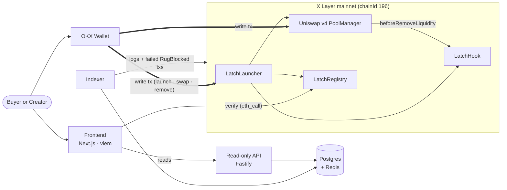

# Latch

**A Uniswap v4 hook that locks launch liquidity onchain — so the rug *reverts* instead of just getting taxed.**

[](https://latch-eta.vercel.app/)
[](https://latch-7241ffdc.mintlify.app/)
[-0A0A0A?style=flat-square)](https://www.oklink.com/xlayer/address/0xf856b2992612d55874cE2f8fB2cAb1B3a5Bf8200)

> Most anti-rug hooks tax the dump. Latch makes the rug *revert*. It changes what the pool **guarantees**, not what it **charges**.

Latch is built for **BuildX · Hook the Future** on X Layer. Every guarantee is enforced inside the Uniswap v4 hook itself — no admin key, no oracle, no third-party LP locker. The pool refuses to be drained, and a buyer can verify the lock straight from chain without trusting any Latch server.

The hook, registry, launcher, and a public demo pool are all **live on X Layer mainnet (chainId 196)**. Uniswap v4 isn't on testnet, so this is the real thing.

---

## ✨ What is Latch?

When a creator pulls launch liquidity, every buyer is wiped out. It's the oldest rug in DeFi.

Most v4 anti-rug hooks tax the dump — they make pulling liquidity expensive. A determined creator just pays the fee and rugs anyway. Latch is a different **class** of hook:

- **`beforeRemoveLiquidity` is a hard invariant, not a price signal.** Pull more than what's released against a public, immutable vesting schedule, and the transaction reverts with `RugBlocked`.
- **Trust-minimised by construction.** No admin key. No oracle. No custodian holding your LP NFT. The lock holds even if the position is sold.
- **In-curve enforcement.** Latch lives inside the pool's own lifecycle — unbypassable, non-custodial, and only possible because of v4 hooks.

Two pieces compose around the hook:

- **`LatchRegistry`** — an onchain directory of locked pools. A buyer reads `isVerified(poolId)` directly from chain to confirm a pool is Latch-locked before they buy. No backend trust required.
- **`LatchLauncher`** — one transaction that deploys the token, initializes the pool, seeds liquidity, writes the schedule, and lists the pool in the registry. There is no window where the pool is live but unprotected.

---

## 🚀 Quick start

### See a rug get blocked in your terminal (no wallet, no gas)

Ask the live demo pool on X Layer mainnet to pull all of its locked liquidity, and watch the real hook refuse:

```bash
cast call 0x6C72e2f113eC4680565388345793f6478D1083e2 \
  "attemptFull()" \
  --rpc-url https://rpc.xlayer.tech
```

It **reverts** — and the revert is the point. v4 wraps the hook's reason as `WrappedError(LatchHook, beforeRemoveLiquidity, RugBlocked(requested, alreadyRemoved, released))`, where `released` is `0` because the demo pool's cliff is far in the future.

### Try the interactive playground

Open **[latch-eta.vercel.app](https://latch-eta.vercel.app/)**:

1. Simulate a live launch — chart climbing, buyers piling in, market cap pumping.
2. Click **Creator: pull all liquidity** — the receipt comes back with `RugBlocked`, the chart never flinches.
3. Click **Replay without Latch** — the same launch, no hook, the pool crashes to zero.
4. Scroll to the **On mainnet** section and send a *real* reverting transaction from your wallet. Gas is a few cents of OKB; the outcome is a permanent failed-rug transaction on OKLink.

### Run it locally

Latch's parts live on **separate branches** of this repo. Clone the branch you want.

| Branch | What lives there | Stack |
|---|---|---|
| [`backend`](https://github.com/treasure567/latch/tree/backend) | Smart contracts | Solidity 0.8.26 · Foundry · uniswap-hooks · v4-core/periphery |
| [`marketing`](https://github.com/treasure567/latch/tree/marketing) | Public site + playground | Next.js 16 · React 19 · Tailwind v4 · viem |
| [`docs`](https://github.com/treasure567/latch/tree/docs) | Public docs site | Mintlify |

```bash
# Contracts
git clone --branch backend https://github.com/treasure567/latch.git latch-backend
cd latch-backend
forge build
forge test -vvv

# Fork-test against the live X Layer mainnet hook
forge test --match-contract RugDemoForkTest

# Marketing site (the playground)
git clone --branch marketing https://github.com/treasure567/latch.git latch-marketing
cd latch-marketing && npm install && npm run dev
```

---

## 🏗 Architecture

Latch is **onchain-first**. Every guarantee is enforced in the hook; nothing off-chain is in the trust path. A Latch pool stays rug-proof even if every Latch server is down.



- **Writes go straight from the user's wallet to the contracts.** No middleman.
- **The indexer is read-only by construction.** It captures both `LiquidityReleased` events and **failed** `RugBlocked` transactions — a blocked rug is a failed tx, not a log event (the revert rolls back its logs).
- **The frontend verifies pools live via `eth_call`** to the registry. If every Latch server is down, a buyer can still confirm a pool is locked.

Full architecture, the removal-gate sequence, and the atomic launch sequence are in the [docs site](https://latch-7241ffdc.mintlify.app/build/architecture).

---

## ⛓️ Deployed contracts · X Layer mainnet (chainId 196)

| Contract | Address |
|---|---|
| **LatchHook** (the gate) | [`0xf856b2992612d55874cE2f8fB2cAb1B3a5Bf8200`](https://www.oklink.com/xlayer/address/0xf856b2992612d55874cE2f8fB2cAb1B3a5Bf8200) |
| **LatchRegistry** (verify before you buy) | [`0x5Af8F4928A776A7d656B873CF91B9614C8c23f86`](https://www.oklink.com/xlayer/address/0x5Af8F4928A776A7d656B873CF91B9614C8c23f86) |
| **LatchLauncher** (one-tx launch) | [`0x253B3520d8c75151F3c6EE02741e2f7DB2fF5c69`](https://www.oklink.com/xlayer/address/0x253B3520d8c75151F3c6EE02741e2f7DB2fF5c69) |
| **RugDemo** (live demo pool) | [`0x6C72e2f113eC4680565388345793f6478D1083e2`](https://www.oklink.com/xlayer/address/0x6C72e2f113eC4680565388345793f6478D1083e2) |
| Uniswap v4 `PoolManager` | [`0x360E68faCcca8cA495c1B759Fd9EEe466db9FB32`](https://www.oklink.com/xlayer/address/0x360E68faCcca8cA495c1B759Fd9EEe466db9FB32) |

The hook address's low 14 bits are exactly `0x200` — the `BEFORE_REMOVE_LIQUIDITY` flag — mined via `HookMiner` CREATE2 so the v4 PoolManager dispatches `beforeRemoveLiquidity` to it.

`RugDemo` is a self-contained, valueless demo pool anyone can fire `attempt()` / `attemptFull()` at. The real hook reverts every attempt.

---

## 🔧 How the hook works

```solidity
function _beforeRemoveLiquidity(
    address /*sender*/,
    PoolKey calldata key,
    ModifyLiquidityParams calldata params,
    bytes calldata /*hookData*/
) internal override returns (bytes4) {
    PoolId id = key.toId();
    Schedule storage s = schedules[id];
    if (s.totalLocked == 0) return BaseHook.beforeRemoveLiquidity.selector;
    if (params.liquidityDelta >= 0) return BaseHook.beforeRemoveLiquidity.selector;

    uint256 removeAmount = uint256(uint128(-params.liquidityDelta));
    uint256 released = LatchMath.releasedAmount(s, block.timestamp);
    uint256 already  = removedSoFar[id];

    if (already + removeAmount > released) {
        revert RugBlocked(removeAmount, already, released);
    }
    removedSoFar[id] = already + removeAmount;
    emit LiquidityReleased(id, removeAmount, removedSoFar[id], released);
    return BaseHook.beforeRemoveLiquidity.selector;
}
```

- The schedule is written **exactly once** via `setSchedule` and is **public + immutable** afterward.
- `releasedAmount` returns `0` before `cliffTime`, then unlocks one equal step per `periodLength`, capping at `totalLocked` after `periodsCount` steps.
- The cumulative `removedSoFar[id]` accounting means many small removals across many transactions are summed against the released amount — you cannot drain the pool by splitting a rug into pieces.
- The hook fires regardless of *who* calls `modifyLiquidity` — so transferring the LP NFT does not bypass the lock.

A blocked rug is a **failed transaction**, not a log event (a revert rolls back logs). The receipts feed indexes failed `RugBlocked` txs rather than listening for an event.

---

## 🔗 Links

| | |
|---|---|
| **Live app** | https://latch-eta.vercel.app |
| **Docs** | https://latch-7241ffdc.mintlify.app |
| **X / Twitter** | [@xdev_hack](https://x.com/xdev_hack) |
| **Hook on explorer** | https://www.oklink.com/xlayer/address/0xf856b2992612d55874cE2f8fB2cAb1B3a5Bf8200 |
| **Demo pool on explorer** | https://www.oklink.com/xlayer/address/0x6C72e2f113eC4680565388345793f6478D1083e2 |

---

## 🏆 Hackathon

Built for **BuildX · Hook the Future** on X Layer — the Uniswap v4 hooks track. Scored on Innovation, Market potential, Completion, and Demo video.

---

## 👥 Team

| Name | Telegram | X / Twitter |
|---|---|---|
| Treasure | [@david_luis3](https://t.me/david_luis3) | [@treasure_devops](https://x.com/treasure_devops) |
| Enoch | [@scoobnoob](https://t.me/scoobnoob) | [@Enochidx](https://x.com/Enochidx) |
| Naheem | [@naheem_tg](https://t.me/naheem_tg) | [@naheem__x](https://x.com/naheem__x) |
