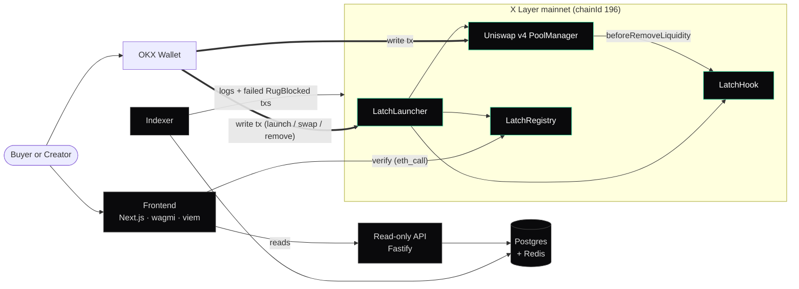

Latch is **onchain-first**. Every guarantee is enforced in the hook; nothing off-chain is in the trust path. A Latch pool stays rug-proof even if every Latch server is down.

<Note>
  The backend never holds keys, never signs, and never custodies funds. Writes — launch, buy, remove — go straight from the user's wallet to the contracts. The backend only reads.
</Note>

## The trust boundary

<CardGroup cols={2}>
  <Card title="In the trust path" icon="lock">
    The contracts. `LatchHook`, `LatchRegistry`, `LatchLauncher`, and the v4 `PoolManager`. This is where every guarantee is enforced.
  </Card>
  <Card title="Not in the trust path" icon="server">
    The indexer, API, and frontend. They make Latch usable and observable, but a failure here cannot unlock a pool or fake a verification.
  </Card>
</CardGroup>

## System diagram

Writes (launch, swap, attempted removal) go straight from the user's wallet to the contracts on X Layer mainnet. The backend only reads — it indexes logs and failed transactions and serves them through a read-only API.

<Tip>
  The double arrows are the write paths in the trust boundary. Everything off-chain only reads.
</Tip>

## Technology stack

| Layer | Technology |
| --- | --- |
| Contracts | Solidity 0.8.26 · Foundry · `uniswap-hooks` · v4-core/periphery · OpenZeppelin |
| Address mining | `HookMiner` + CREATE2 (encodes `BEFORE_REMOVE_LIQUIDITY_FLAG`) |
| Chain | X Layer mainnet (zkEVM, Polygon CDK, OKB gas) |
| Frontend | Next.js 16 (App Router) · React 19 · Tailwind v4 · viem 2 |
| Indexer | Subscribes to `PoolLaunched`, `PoolVerified`, `LiquidityReleased`, and failed `RugBlocked` transactions |
| Storage | Postgres (pools, schedules, event log) · Redis (cache + pub/sub) |
| API | Fastify · read-only |

## Backend: read-only indexer

The backend subscribes to X Layer logs and decodes them into a queryable store. It is read-only by construction.

<Steps>
  <Step title="Subscribe to logs">
    An indexer watches X Layer for `PoolLaunched`, `PoolVerified`, `LiquidityReleased`, and **failed `RugBlocked` transactions**.
  </Step>
  <Step title="Decode into Postgres">
    Events are decoded into Postgres: `pools`, `schedules`, and an event log.
  </Step>
  <Step title="Cache and pub/sub via Redis">
    Redis backs the cache and the live-feed pub/sub for the receipts feed.
  </Step>
  <Step title="Serve a read-only API">
    A Fastify API exposes the data — no write endpoints.
  </Step>
</Steps>

<Warning>
  A blocked rug is a **failed transaction**, not a log event — a revert rolls back its logs. The indexer captures these by watching for failed txs carrying the `RugBlocked` revert reason, not by listening for an event. See [The Lock](/concepts/the-lock).
</Warning>

### Read-only API

<ParamField path="GET /verify/:pool" type="endpoint">
  Verification status and schedule for a pool.
</ParamField>
<ParamField path="GET /registry" type="endpoint">
  The directory of Latch pools.
</ParamField>
<ParamField path="GET /stats" type="endpoint">
  Aggregate stats across Latch pools.
</ParamField>

## Frontend: thin and chain-first

A thin Next.js app with wallet connect via `wagmi` and OKX Wallet.

<CardGroup cols={3}>
  <Card title="The registry (hero)" icon="magnifying-glass">
    Search a pool or token to see Latch Verified status, the release schedule, and time to next unlock — read live from chain.
  </Card>
  <Card title="Receipts feed" icon="receipt">
    A live feed of blocked rugs (failed `RugBlocked` txs) and `LiquidityReleased` events.
  </Card>
  <Card title="Launch form" icon="rocket">
    The one-transaction launch, signed from the user's own wallet.
  </Card>
</CardGroup>

<Info>
  Because the hero surface reads verification directly from the registry contract, a buyer can confirm a pool is locked even if the Latch API is unavailable.
</Info>
