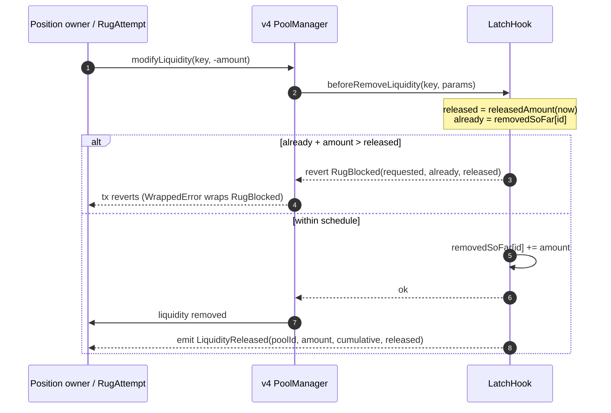

`LatchHook` is the core guarantee. It is a Uniswap v4 hook that enforces a vesting schedule on liquidity removal. An attempt to pull more liquidity than the schedule has released **reverts**.

## A revert, not a fee

`getHookPermissions()` enables **only** `beforeRemoveLiquidity` — everything else is `false`. Latch is deliberately not a fee hook and never touches the swap fee. The lock is enforced at the one moment that matters: when someone tries to take liquidity out.

<Info>
  Enforcement is pure pool state: no oracle, no identity check, no admin key. The gate fires regardless of who owns or transfers the LP position — so transferring the LP NFT does not bypass the lock.
</Info>

## The vesting schedule

A pool's schedule is written **exactly once** via `setSchedule`.

```solidity
function setSchedule(
    PoolKey key,
    uint64 cliffTime,
    uint64 periodLength,
    uint32 periodsCount,
    uint256 totalLocked
) external;
```

<ParamField path="cliffTime" type="uint64">
  No liquidity is released before this timestamp.
</ParamField>
<ParamField path="periodLength" type="uint64">
  Length of one unlock step, in seconds. Must be non-zero.
</ParamField>
<ParamField path="periodsCount" type="uint32">
  Number of equal steps. Must be non-zero.
</ParamField>
<ParamField path="totalLocked" type="uint256">
  Total locked liquidity in v4 liquidity units (L). Must be non-zero.
</ParamField>

`setSchedule` reverts `ScheduleExists` if a schedule is already set, and `InvalidSchedule` if `periodLength`, `periodsCount`, or `totalLocked` is `0`. It records `creator` as `msg.sender` — **for transparency only; this confers no privilege**. It emits `ScheduleSet(poolId, creator, totalLocked, cliffTime, periodLength, periodsCount)`.

<Note>
  The schedule is stepwise, not continuous. `releasedAmount` returns `0` before `cliffTime`, then unlocks one equal step (`totalLocked / periodsCount`) per `periodLength` elapsed after the cliff, reaching `totalLocked` after `periodsCount` steps.
</Note>

## How removal is gated

`_beforeRemoveLiquidity` runs before every liquidity removal:

<Steps>
  <Step title="Pass-throughs">
    A pool with no schedule (`totalLocked == 0`) is not Latch-governed and passes through. Non-removals pass.
  </Step>
  <Step title="Compute the release">
    `removeAmount = uint256(-liquidityDelta)`; `released = releasedAmount(now)`; `already = removedSoFar[id]`.
  </Step>
  <Step title="Enforce the cap">
    If `already + removeAmount > released`, it reverts `RugBlocked(requested, alreadyRemoved, released)`.
  </Step>
  <Step title="Otherwise allow">
    It updates `removedSoFar` and emits `LiquidityReleased(poolId, amount, cumulativeRemoved, released)`.
  </Step>
</Steps>

The cumulative `removedSoFar[id]` accounting means removals across many transactions are summed against the released amount — you cannot drain the pool with a series of small pulls.

### Flow of a removal



The gate fires regardless of *who* called `modifyLiquidity`, and before any position state changes — so a stranger calling against an empty position still reverts at the hook, not at the position check.

## A blocked rug is a failed transaction

<Warning>
  `RugBlocked` is a custom **error**, not an event. A reverting transaction rolls back its logs — so the onchain artifact of a blocked rug is the **failed transaction** carrying the `RugBlocked` revert reason. In v4 it is re-wrapped as a `WrappedError`.
</Warning>

This matters for indexing and for the receipts feed: releases show up as `LiquidityReleased` events, but blocked rugs show up as failed txs, not log events. See [Build → Contracts](/build/contracts) for how the indexer captures both.

## View helpers

<ResponseField name="releasedAmount(PoolId id, uint256 timestamp)" type="uint256">
  Cumulative liquidity released at a given time.
</ResponseField>
<ResponseField name="wouldExceedLock(PoolId id, uint256 amount, uint256 timestamp)" type="bool">
  Helper to check whether a removal of `amount` would exceed the lock at `timestamp`.
</ResponseField>
